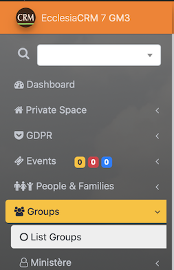
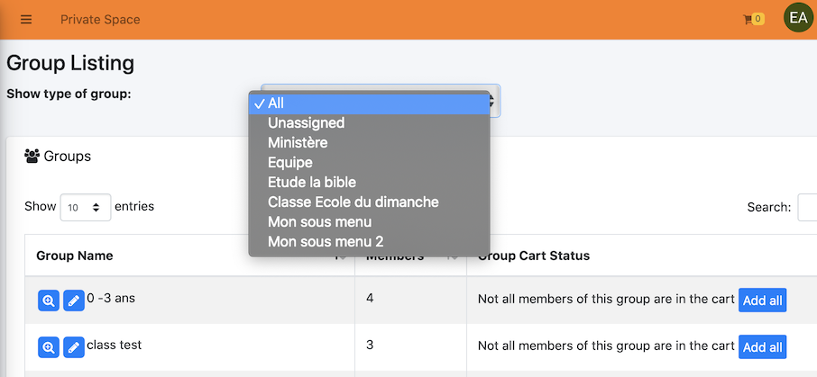
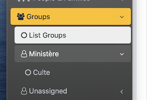
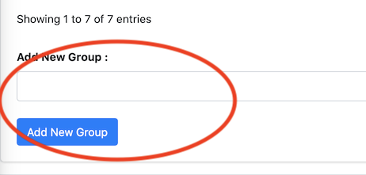
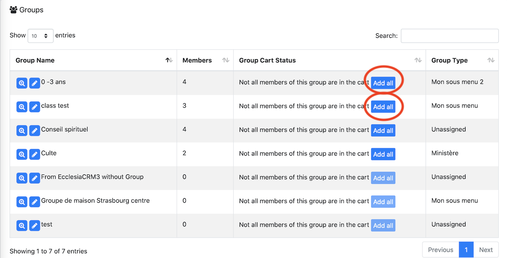
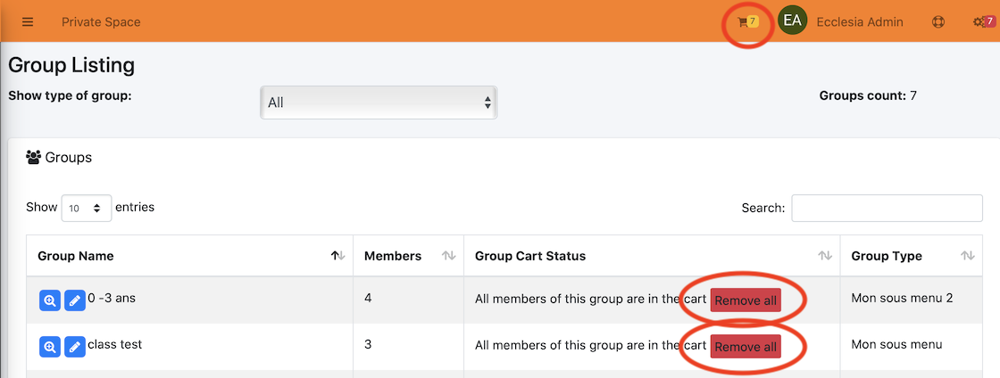

# 
<big>Groups</big>

## Overview

The groups in **CRM** have a preponderant place in :

- Gathering a few people in a same "container"
- Sending emails
- Managing the Sundayschool groups
- Classifying the menues, by "types" in the left sidebar; which is as possible with the classic groups than the sundayschool groups.

Via the "Cart", the users will be able to :

- Do CSV extractions
- Print
- create to a directory
- create to labels
- create to badges
- create QR code badges
- Making appointment
- create exportable address book.

##Have access to the groups

To have to all the groups, one has to open the sude bare, as following :

One selects "List Groups":

Then classify the groups by "kind"

There, one only will have the sundayschool groups

**Note** The kind of group provides the classification of the groups in the left sidebar.

##Add a new group

One has to go at the bottom of the group listing, as following :

One adds:

- The name of the group
- Then click on "Add New Group"

##Put one or more members in the "cart"

The user has to have a cart role to use this tool.

One goes to the section "List all the groups"

**Note**

- Two groups are add to cart
- The cart icon has the some of the users accounts

To do that, consult the section "Cart"

