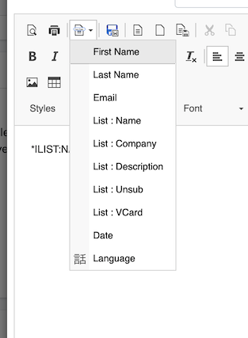
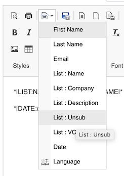
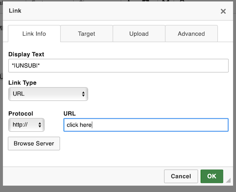
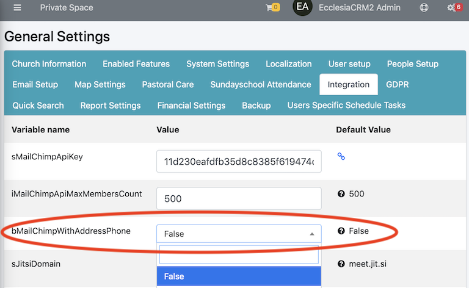
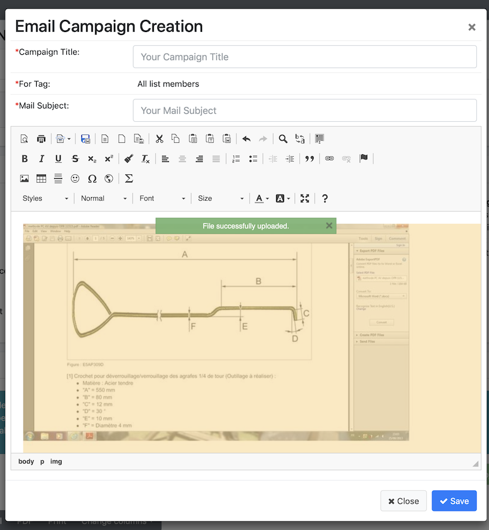
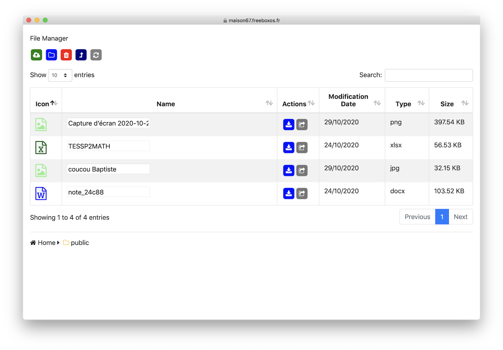
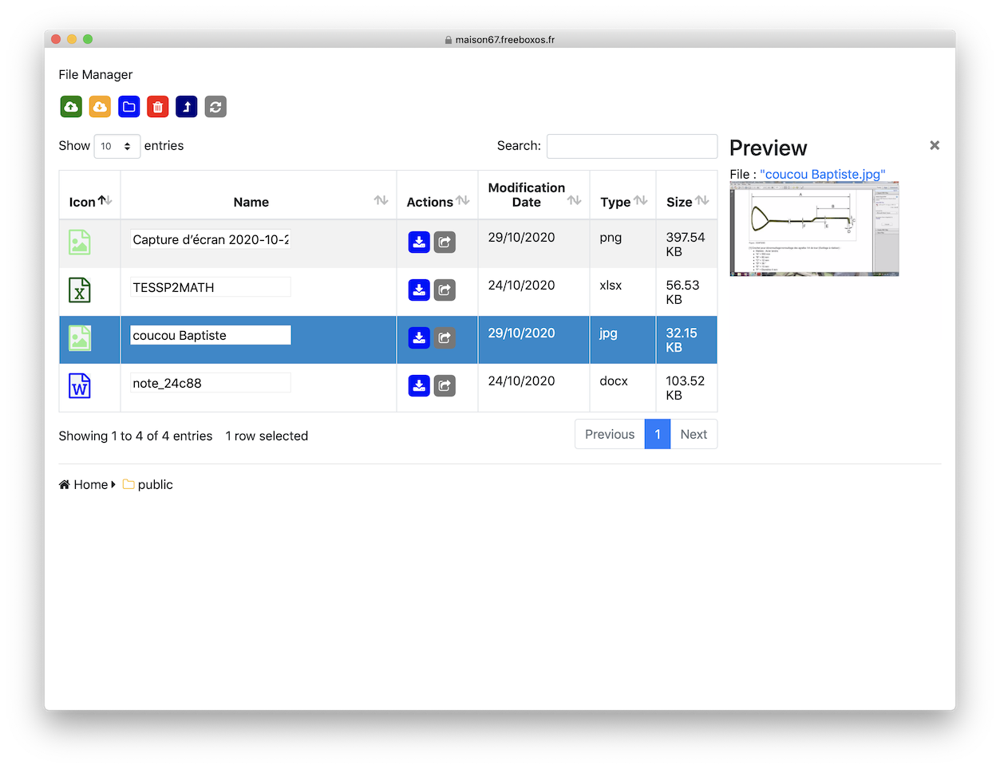

# <center><big>Campaign management</big></center>

**Warning** about the pictures management, the file manager has to point on the public file. This is normally automatic.

Because every image inserted in the campaign has to have public links (and not private).

##Create a campaign

Click on the following button or select each member without tags


Or select a tag


then one will be able to create the body text of the campaign


One can now select the campaign's title and the email's object

##Management of a standard email (code field: mailing)

It is now possible to use Mailchimp code Fields, which can make standard email



The following example shows the FNAME, LNAME and the creation date of the email


When the campaign is sent the FNAME and LNAME of each user will be substitute to the code field.

- One can create an unsubscribing link with the mailing list<br>
To this end, one has to use a code field




Wich results in


Then selects the text ````*|UNSUB|*````

 

and



And click on "ok"

**Note** in the general settings, it is possible to add the address and phone number of each user.



##Insert pictures or documents


- Drop them in the text zone


The image's link is public



You can change the size

- With the file manager


dialog box



Click on "browse the server"



then the file manager


One can download a picture with the server


And selects the file to drop


- And dropping a file is possible in an email too


Here's the attachment file


Once the campaign is done, one can "save" it

##Plan the mailing

Save the campaign and one will be on the sending page


Here one will be able to sava, send, delete or fix a date and a time for their campaign


**Note**
- It is advised to create a bank of templates to use them later, to do this one has to go in "Manual: User" and "Documents" and last in "Documents & Templates".
- It is possible to modify it later too.
- You can schedule your campaign.
