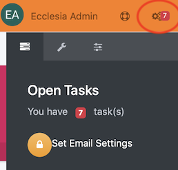
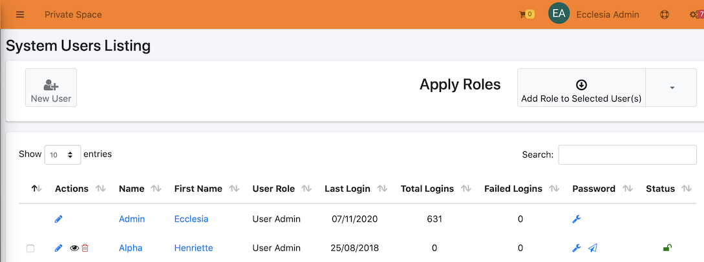
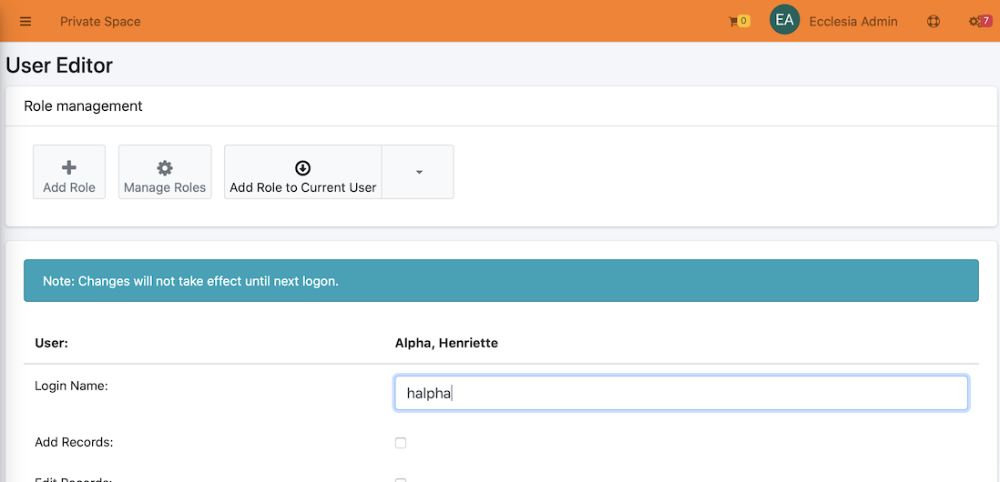
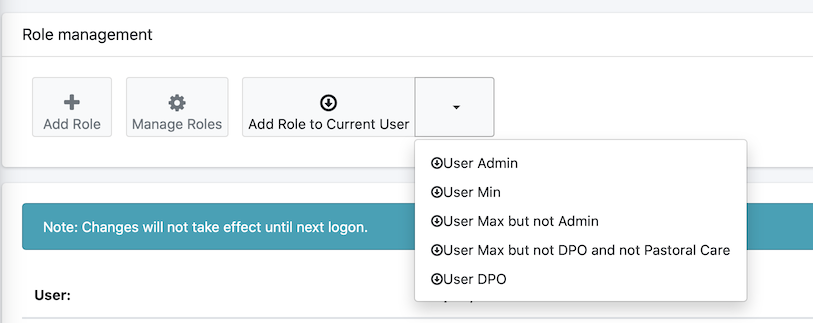
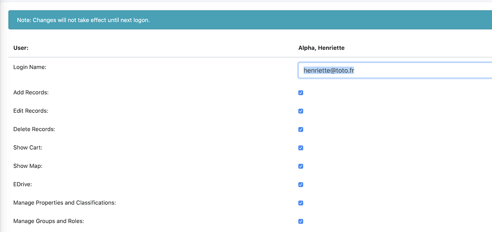
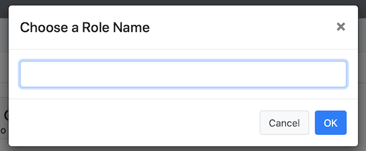
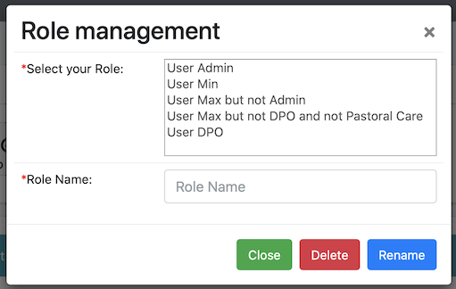

## Introduction

**WARNING** to create a user role, an user role has to be made in addition to the administrator.
	By default, two roles are installed

##Role management

1. To access the role management:
	* Go to settings

		

	* Then "user system"

		

	* Now, one will be able to manage with the users

		

2.to modify one, click on the pen icon in the reference lign of a user

##Assign a role to a user

Go to "user system", select a user

1. Once one did the steps as mentioned, the result will be:

	

2. One can use a default role:

	

3. The boxes shown here will be tick:

	

4. And finally store the new settings

##Create a role

Go to "user system", select a user

1. Tick all the boxes you need for the selected user

2. Click on the button:

	

3. Associate a name:

	

##Change the name or delete a role

Go to "user system", select a user

1. Select the following button:

	

2. Follow the steps:

	

