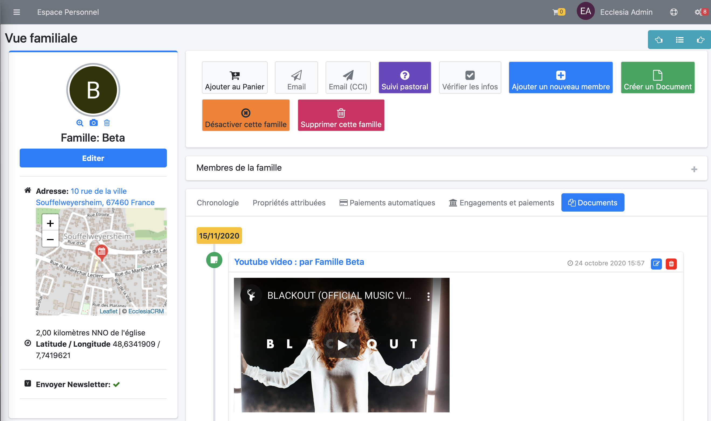

# 
<big>Famille & Ecclesia**CRM** </big>

Ecclesia**CRM** fait de la famille une place centrale, la définition d'une famille dans ce CRM est polymorphe. La famille n'est pas figée est peut-etre définie au travers de son nom, de ses membres, de son numéro de téléphone, mais vous pourrez constater que l'on peut rajouter autant de champs personnalisables que l'on veut.

**NewsLetter** une famille peut recevoir la lettre de news.

##Une famille : une adresse

Chaque personne dans le CRM a une adresse, la notion de famille permet de pouvoir réellement affecter une adresse.

##Une famille : des rôles.

Chaque membre dans la famille a un rôle bien définie

- le représentant familiale
- le conjoint ou la conjointe
- les enfants ...

Le représentant de famille est capitale pour visualiser une famille sur la carte des membres.

Cette partie est personnalisable dans la partie "Gestion des Personnes" et "Personnalisation".

##Une famille : des propriétés

Une famille au départ doit être pensée avec ces propriétés personnalisables
* une famille par exemple mono parentale
* une famille à aider
* etc ...

Cette partie est personnalisable dans la partie "Gestion des Personnes" et "Personnalisation".

##Une famille : des champs personnalisables

Il est possible de rajouter autant de champ personnalisables que l'ont veut pour une famille.

Les champs personnalisables sont de type :

- Boolean : 
- Date    :
- Du texte de type 50 ou 100 ou infini en terme de caractères :
- Année   :
- Saison  :
- Nombre  :
- Personne du groupe : 
- Argent  :
- Numéro de téléphone :
- Liste personnalisable déroulante : 

A vous d'avoir des idées.

##Une famille : fonds ou des paiements automatiques

Une famille peut faire des dons, bien entendu et ces dons seront réclamés dans le cas d'un reçu fiscal.

## Des notes aussi

Une famille peut conserver des notes assez sophistiqués.

