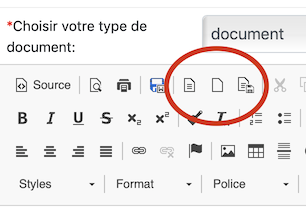
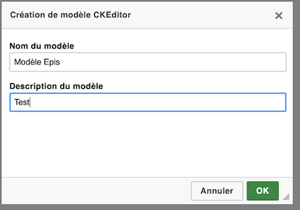
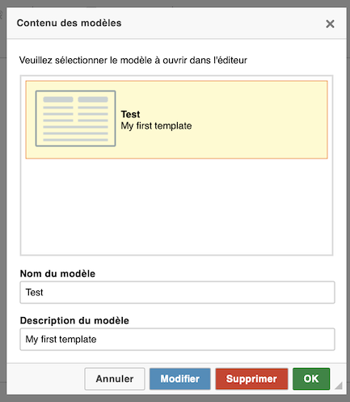

Il est possible depuis la version 4.1 d'EcclesiaCRM de gérer les modèles de document.

## Création

1. Aller dans un document, CKEditor

    - Pour cela aller dans votre personnel

       

2. Ajouter un document

   

3. Vous disposerez de toute une série d'icônes, notamment les trois premières permettant de gérer les modèles

   

4. Le créer

    - dans un premier temps, formater votre document comme bon vous semble.

   - Vous pourrez ensuite le rajouter à la liste de vos Modèles

   - On clique l'icône

      

   - On donne un nom au modèle et une description 
      

5. Gestion des profiles

    - quand un profile est créé, il est possible de le renommer ou de le supprimer

       

    - Vous pourrez le renommer ou le supprimer facilement

       

6. Appliquer

   

## Remarque

- Vous faire de même avec les calendriers groupes et partagé.
- Un calendrier groupe ne peut être rajouté que par un admin.
- Les modèles sont très utiles dans le cas de MailChimp pour créer des campagnes.

