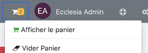
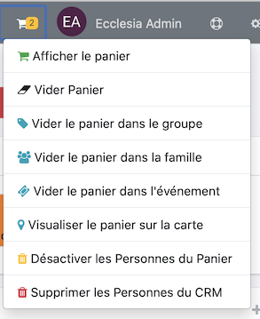
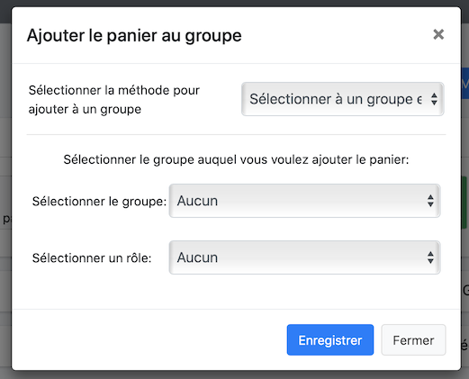

# 
<big>Panier & Ecclesia**CRM** </big>

Le panier contient temporairement les personnes que vous y avez rajouté. Vous pourrez rajouter autant de personnes, de personnes d'un groupe ou via une extraction, puis les traiter en lot pour envoyer des Mails créer un annuaire, créer des badges ou des entêtes d'enveloppe.

Vous pourrez également les affecter à un groupe ou créer un groupe de personne ou encore les affecter à une même famille.

Vous pourrez en ajouter autant qu'il y a de personnes dans le CRM. Ajouter quelqu'un dans le panier ne modifie rien dans la personne en elle même, elles sont simplement temporairement stocké dans le panier. Ajouter, supprimer, ou traiter une personne du panier ne modifier en rien les paramètres du compte de cette même personne.

Le panier est propre à l'utilisateur et à la session en cours. Chaque utilisateur du système a propre panier qui sera valide tant que l'utilisateur ne se sera pas déconnecté.

> Note: Le panier est un des outils les plus puissants d'Ecclesi**CRM**, il permet de gérer la création de groupe, les extractions d'une partie des membres sous forme de fichier CSV, d'annuaire, etc ...

##Ajouter le rôle Panier à un utilisateur

Un administrateur peut ajouter le rôle de panier à un utilisateur, via le panneau "Manuel : Administrateur → Droits et gestion des utilisateurs du CRM → Gestion des profiles utilisateurs".

##Comment voir le contenu de mon Panier ?

Vous trouverez le panier dans la barre d'outils en haut de votre fenêtre, elle indique en temps réel le nombre d'item dans votre Panier. Ce compte augmentera ou diminuera quand vous ajouterez ou retrancherez des personnes.

 

En cliquant sur le Panier, un menu contextuel apparaîtra, qui vous permettra de visualiser le Panier ou plus.

##Comment ajouter une personne au panier ?

Il y a plusieurs manières de le faire

- Pour ajouter une personne seule:

    1. Soit aller dans la barre latérale gauche et déployer "Personnes & Familles" Puis "Afficher toutes les Personnes", vous aurez la liste des personnes ou vous pourrez ajouter une ou plusieurs personnes dans le Panier via l'icône ad'hoc.
    2. Ou saisir le nom d'une personne dans le champ de recherche de la barre latérale.
    3. Quand le nom de la personne ou de la famille apparaîtra un bouton "Ajouter au Panier" vous permettra d'ajouter la personne ou toute la famille.
    4. Si la personne n'est pas déjà présente dans le Panier, elle y sera ajoutée.

- Alternativement:

    1. Consulter le profile d'une personne, et utiliser le bouton "Ajouter au Panier".
    2. Vous obtiendrez le même résultat qu'avec la même méthode citée ci-dessus.
    3. Il est aussi possible de passer par le fait d'ajouter les personnes via : les résultats d'une recherche avancées, ou par exemple quand on fait des recherches via le Menu des Requêtes.
    
    
Très souvent le bouton "Ajouter au Panier" sera présent. Il est ensuite possible d'utiliser le menu Panier et d'ajouter toutes les personnes à un groupe ou encore de créer un groupe pour les y ajouter.

Pour cela utiliser "Vider le Panier dans Le Groupe" (sous "Panier"). Utiliser "Sélectionner un groupe existant" ou "Créer un nouveau Groupe" - En créant un nouveau groupe tout le contenu du Panier y sera vidé.

Tout sera finalement fait via le CRM.

##Comment supprimer une personne du Panier ?

1. Vous ouvrez le menu Panier, puis "Afficher le Panier" un bouton "Vider le Panier" permettra de vider tout le panier.
2. En bas de page, vous aurez la liste des personnes dans le Panier, vous pourrez supprimer une ou plusieurs personnes dans ce Panier.

> Note: Pour vider le panier complètement, cliquer le bouton "Vider le Panier" en haut de la page, ou dans le menu. (Ne pas confondre "Vider le Panier dans Le Groupe.", "Vider le Panier" effacera simplement les personne du panier, sans placer les personnes à un autre endroit.) Vous pourrez aussi ajouter les personnes à une famille. **Attention si vous choisissez "Supprimer les personnes du CRM" cette option est irréversible**